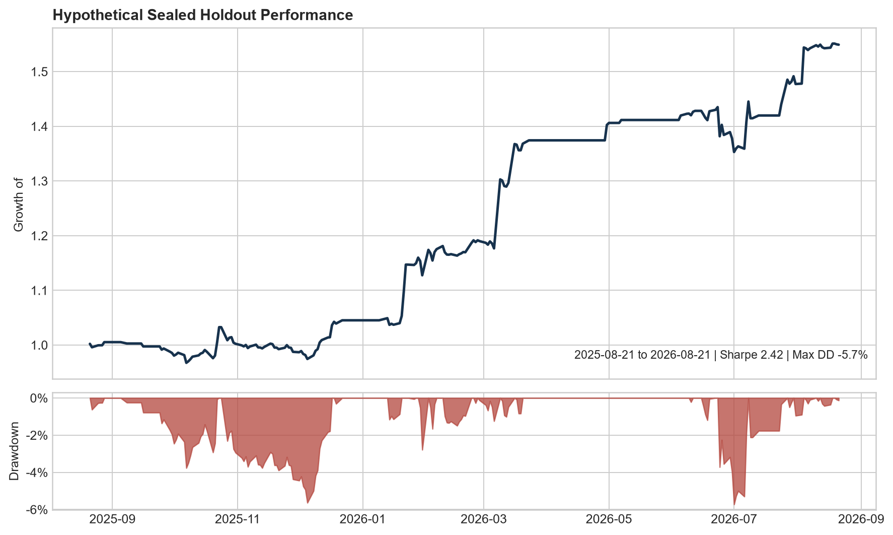

# Systematic Futures Portfolio Research

Research, validation, and portfolio construction for systematic futures strategies using explicit temporal separation, realistic execution assumptions, robustness testing, and holdout evaluation.

> **Research status:** The results below are hypothetical research candidates, not live trading performance. They require paper/shadow validation and contract-level execution review before capital deployment.

## Primary portfolio — A-Tier Strategy 1

A-Tier Strategy 1 combines seven frozen rule sets across metals, energy, equity index, and currency futures. They were evaluated over one untouched one-year holdout. Five of the seven individual strategies were profitable; the combined portfolio produced the following result.

| Metric | Holdout result |
|---|---:|
| Holdout period | Aug 22, 2025 – Aug 21, 2026 |
| Markets | GC, CL, ES, HG, 6J, NG, 6E |
| Strategies | 7 |
| Profitable individual strategies | 5 / 7 |
| Trades | 1,471 |
| Initial capital | $700,000 |
| Net profit | $194,682 |
| Return | 27.81% |
| Daily Sharpe | 1.89 |
| Profit factor | 1.1765 |
| Win rate | 54.66% |
| Max chronological daily closed-trade drawdown | -7.37% |
| Average trade | $132.53 |

Execution assumptions were one contract per strategy, one tick of slippage, and an observed $7 round-turn cost. The requested $5 commission setting and observed ledger cost remain an explicit reconciliation item.

### Reviewer quick path

1. [A-Tier Strategy 1 overview and individual statistics](deliverables/s%71x_holdout_portfolio/README.md)
2. [Frozen holdout summary](deliverables/s%71x_holdout_portfolio/reports/holdout_summary.json)
3. [Full visual holdout report](deliverables/s%71x_holdout_portfolio/reports/holdout_visual_report/holdout_visual_report.html)
4. [Research methodology](docs/RESEARCH_METHOD.md)
5. [Results and limitations](docs/RESULTS_AND_LIMITATIONS.md)
6. [Reproducibility information](docs/REPRODUCIBILITY.md)
7. [Separate CL / 6J / NG sealed research candidate](saved_strategies/BEST_STRATEGIES/tier_a_sealed_validated/stable_daily_session_2026-08-23)

## Secondary research — CL / 6J / NG session-reversal candidate

The separate custom-research candidate combines three session-reversal rules using crude oil, Japanese yen, and natural gas futures. Parameters and weights were frozen before its sealed year was accessed.

| Metric | Sealed holdout |
|---|---:|
| Period | Aug 21, 2025 – Aug 21, 2026 |
| Total return | 54.9% |
| Annualized return | 44.1% |
| Annualized volatility | 18.2% |
| Sharpe ratio | 2.42 |
| Maximum drawdown | -5.7% |
| Positive months | 10 of 13 |
| Positive quarters | 4 of 5 |



This candidate demonstrates point-in-time signal research, temporal validation, physical holdout controls, robustness tests, and a sealed evaluation. It is distinct from A-Tier Strategy 1 above.

## What the repository demonstrates

- Point-in-time feature engineering and explicit execution delays
- Development/holdout separation with embargo and physical access controls
- Research across momentum, trend, mean reversion, breakout, relative value, lead/lag, and independently specified hypotheses
- Constrained portfolio construction and correlation-aware allocation
- Turnover-based costs, cost stress tests, parameter-neighbor checks, walk-forward folds, and block-bootstrap analysis
- Reproducible Python environments and automated tests
- Candid retention of unsuccessful strategies and unresolved reconciliation items

## Repository guide

- [A-Tier Strategy 1 package](deliverables/s%71x_holdout_portfolio): frozen multi-market holdout evidence, statistics, visual report, code, and tests
- [`saved_strategies/BEST_STRATEGIES`](saved_strategies/BEST_STRATEGIES): selected custom-research portfolio and audit evidence
- [`src/systematic_research`](src/systematic_research): reusable research and backtesting modules
- [`tests`](tests): unit, property-based, and regression tests
- [`config`](config): research, validation, universe, instrument, and portfolio assumptions
- [`outputs`](outputs): selected notebooks, diagnostics, and HTML tear sheets
- [`research_program`](research_program): hypothesis and experiment registries
- [`docs`](docs): method, limitations, and reproducibility guidance

## Reproduce the code checks

Requires Python 3.12 and [uv](https://docs.astral.sh/uv/).

```powershell
uv sync --frozen
uv run ruff format --check src tests
uv run ruff check src tests
uv run python -m mypy src
uv run python -m pytest -q
```

Raw and licensed market data are intentionally excluded. Configuration examples and saved evidence make the research design reviewable without redistributing vendor data.

## Disclaimer

This repository documents quantitative research and hypothetical backtests. It is not investment advice, a solicitation, or a claim of live trading performance.
